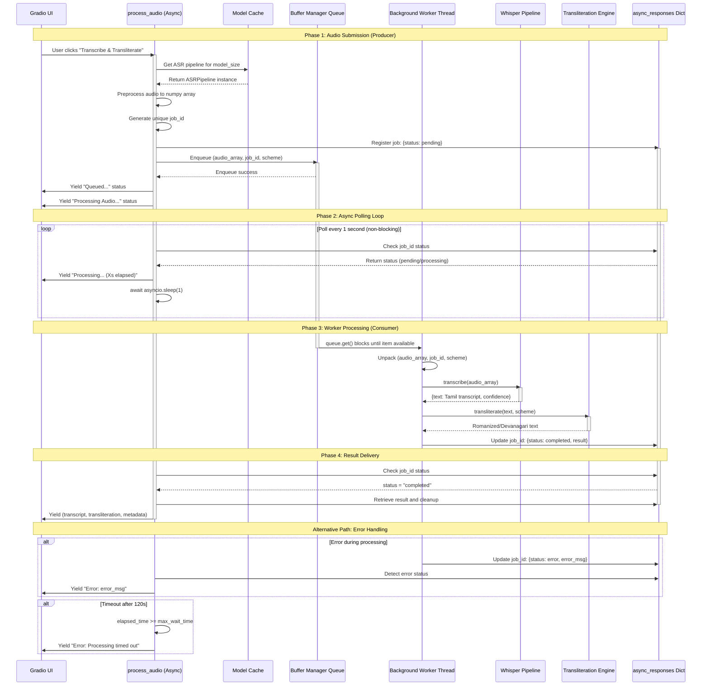

# Buffer Flow Diagram

This document contains the Mermaid.js sequence diagram illustrating the async producer-consumer threading model between Gradio, the Buffer Manager, and the Worker Thread.

## Async Producer-Consumer Sequence Diagram

## Key Design Patterns

### 1. Producer-Consumer Pattern
- **Producer**: Gradio's `process_audio` async function enqueues work items
- **Consumer**: Dedicated background worker thread dequeues and processes
- **Benefit**: Decouples UI responsiveness from heavy ML inference

### 2. Async Polling with Yield
- **Traditional approach**: `job_event.wait(timeout=120.0)` - blocks thread
- **New approach**: `while True: await asyncio.sleep(1)` - non-blocking
- **Benefit**: Frees Gradio/FastAPI worker thread for other requests

### 3. Live Status Streaming
- Uses Gradio's generator/yield support for real-time UI updates
- User sees: "Queued..." → "Processing Audio..." → "Processing... (5s)" → Results
- **Benefit**: Eliminates perceived freezing, improves UX

### 4. Thread-Safe Communication
- `async_responses` dictionary protected by `threading.Lock`
- Job registration, status updates, and result retrieval are atomic
- **Benefit**: Prevents race conditions between threads

## Timing Characteristics

| Operation | Typical Duration | Blocking? |
|-----------|------------------|-----------|
| Audio preprocessing | < 100ms | No (fast numpy ops) |
| Queue enqueue | < 10ms | No (in-memory) |
| asyncio.sleep(1) | 1 second | No (yields to event loop) |
| Whisper inference | 2-30s | Yes (in worker thread) |
| Transliteration | < 1s | Yes (in worker thread) |
| Response polling | < 1ms | No (dict lookup) |

## Concurrency Guarantees

1. **Queue Thread-Safety**: `queue.Queue` provides internal locking
2. **Response Dict Safety**: Explicit `threading.Lock` for all access
3. **Job Isolation**: Unique job_id prevents cross-talk between requests
4. **Backpressure**: Queue max size (10) prevents memory exhaustion
