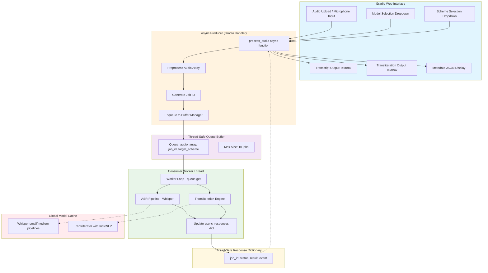

# System Architecture Diagram

This document contains the Mermaid.js flowchart diagram illustrating the complete audio processing pipeline from input to output.

## Audio Processing Pipeline Flowchart

## Component Descriptions

| Component | Responsibility |
|-----------|----------------|
| **Gradio Web Interface** | Handles user interactions, audio upload/recording, displays results |
| **Async Producer** | Preprocesses audio, generates job IDs, enqueues work items |
| **Buffer Manager** | Thread-safe queue with max size limit for backpressure |
| **Background Worker** | Consumes jobs, runs Whisper ASR and transliteration |
| **Model Cache** | Global singleton cache for loaded ML models |
| **Async Responses** | Thread-safe dictionary for job status/result communication |

## Data Flow

1. User uploads/records audio via Gradio interface
2. `process_audio` async function preprocesses audio to numpy array
3. Unique job ID generated and job registered in `async_responses`
4. Audio tuple enqueued to buffer manager (producer)
5. Background worker dequeues job (consumer)
6. Whisper pipeline transcribes audio to Tamil text
7. Transliteration engine converts to target script scheme
8. Results stored in `async_responses` dictionary
9. Async polling loop detects completion and streams results to UI
